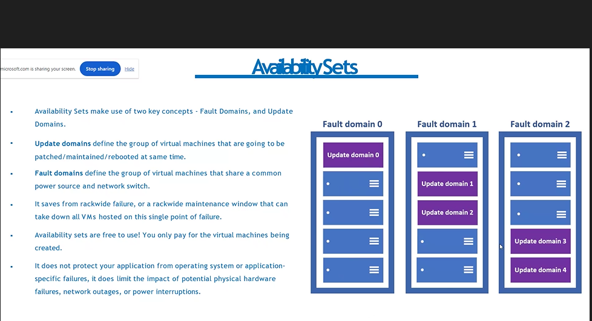

# INTRODUCTION

- Cloud Computing -> renting IT Resources
- on demand resources delivered to you over the internet

# ADVANTAGES

1. no intial invesment
2. pay only for much you use
3. scale up and scale down in minutes
4. new it resources are a click away
5. reduce resource delpoyment time from weeks to minutes
6. go global in minutes

# COMPUTING MODELS

1. SaaS -> Software as a Service -> no need to do anything , only use
2. PaaS -> Platform as a Service -> platform is provided(OS,Setup) , we have to write only code
3. IaaS -> we have to take care of the complete infrastructure.

- Taxi and Bus are Saas
- Rental is Paas
- Own car is Iaas

- Virtual Machine is IaaS
- Azure Storage is Paas 

- Iaas is the most flexible cloud service , we can configure and manage hardware of our application

- PaaS focuses on app developement, platform management id handled by cloud provider

- Saas pay as you go pricing model for using software

# DEPLOYMENT MODELS

1. Public - owned and managed by a third party cloud
2. Private - utilized by particular organization
3. Hybrid - combination of public and private , but complicated to handle what is private and what is public.

# CLOUD PRICING MODELS

- Load Balancer divides the load equally across servers

# PAY 
- Cosmos DB -> the bill will be according how much data we read, write and delete...

# CLOUD SOLUTIONS

- some third party other than cloud providers, provides solutions to customers, such as golden partners like wipro(they rent many servers from cloud providers).

# AZURE GLOBAL INFRASTRUCTURE

- every region has a data centre or multiple data centres
- region is a physical location where data centres are clustered
- availabiity zones are used for backup

## AZURE REGION PAIRS

- each region is always paired with another region within same geography
- data centres are usually 300+ miles apart
- automatic replication and failover for some azure services
- if there is a outage , one region of the pair is prioritized so that atleast one region is recovered 

## ORGANIZING STRUCTURE FOR RESOURCES

- all the services are resources
- resources are combined into resource group which acts as a logical container into which azure resources like web apps , databases and storage accounts are deployed and managed
- Subscriptions groups together user accounts and resources that have been created by those user accounts
- all subscriptions in management group automatically inherit the conditions applied to the management group.
- management groups manage access, policy of subscriptions

- each resource can exist in only one resource group

- when we delete a resource group all the resources are deleted

- to create a resource group we can use portal, powershell, azure cli or an arm template

- each management group and subscription can support only one parent.

## ARM

- azure resource manager

- arm has templates to create resources autoamtically

- ARM template is a JSON file that defiens what you want to deploy to azure 

# AZURE ACTIVE DIRECTORY 

- identity and access management
- user infromation is stored in azure AD by organization

- Tenant represents a organization
- tenant is automatically created when your organization signs up for microsoft cloud service organization

# USER ACCOUNTS

1. Cloud Identities - users exists 
2. External Users
3. 

- Azure Ad can also manage devices

- SSO (Single sign-on) - one username and password for many applications

- ROLE BASED ACCESS CONTROL -> allows to control over who has acess to which azure resources and what can those people do with those resources

- role - a collection of permissions

## RBAC TYPES
1. Reader
2. COntributor
3. Owner
4. User Acess Administrator
5. Deny Assignments

## AZURE TAGS

- name value pairs to organize azure resources in azure portal
- primary way to understand data in billing reports
- resources dont inherit any azure tags 

## AZURE POLICY
- control or restrict or audit your resources 

## AZURE STORAGE SERVICE

1. Queue Storage(Messaging)
2. Table Storage
3. Blob Storage(text and Binary)
4. File Storage(file shares)

## DATA REDUNDANCY 

### In primary zone
- Locally Redundant Storage (LRS) -> three synchronous copies in same data center
- Zone Redundant Storage (ZRS) -> three copies in three availability zones 
### in secondary zone
- geo redundant storage -> copies in different regions 
- geo zone redundant storage (GZRS) -> ZRS + GRS 

## BLOB STORAGE 
- binary large object 
- any type or format

- types
1. block blobs - large objects that doesnt use random read and write operations, files that are read from begining to end 
2. Page Blobs - optimized for random read and write 
3. Append Blobs

- Hot -> frequently accessed
- cold -> infrequent accessed(stored for atleast 30 days)
- archive -> rarely accessed

- Windows VM can be accessed using RDP
- Linux VM can be accessed using SSH

## TYPES OF APP SERVICES
1. Web Apps
2. API apps
3. Web Jobs - we can run programs , scripts(to run automatically)
4. Mobile apps

- create a app service plan first to create a web app

# PUBLIC AN PRIVATE IP ADDRESS

## PRIVATE 

- Class A
- Class B
- Class C

# VIRTUAL NETWORK 

- IP address of resource ensures that traffic gets to right server
- each VNet is isolated from others

## SUBNET MASK

- CIDR NOTATION - >  how many IP addresses can be generated
/16 -> last two are available -> 255 *255 number of ip address are available
/8 -> last three are available

# NIC

- to connect VM to VNet 

# USER DEFINED ROUTES 

- Routing : process of finding a path for traffic in network or across network

# VIRTUAL NETWORK PEERING

- to connect two virtual networks in same region or diff regions

- Regional VNEt peering connects Azure Virtual Networks in same region
- GLobal VNet peering conects azure virtual networks in diff region 

# DOMAIN NAME SYSTEM

- Azure DNS provides domain names
- Billing = No of DNS Zones + number of DNS Queries Received 

# NSG
- Network Security Group fileters incoming and outgoing traffic

# FIREWALL RULES

